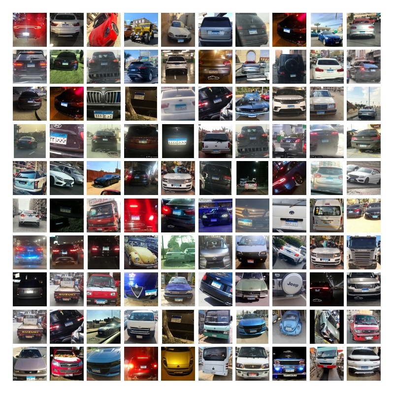

# Egyptian Automatic  License Plate Recognition (EALPR) dataset.


Samples from  EALPR Vehicle images

## Citation 

Please cite EALPR-Dataset in your publications if it helps your research:

```
@INPROCEEDINGS{9845514,
  author={Youssef, Ahmed Ramadan and Sayed, Fawzya Ramadan and Ali, Abdelmgeid Ameen},
  booktitle={2022 7th Asia-Pacific Conference on Intelligent Robot Systems (ACIRS)}, 
  title={A New Benchmark Dataset for Egyptian License Plate Detection and Recognition}, 
  year={2022},
  volume={},
  number={},
  pages={106-111},
  doi={10.1109/ACIRS55390.2022.9845514}}

```
